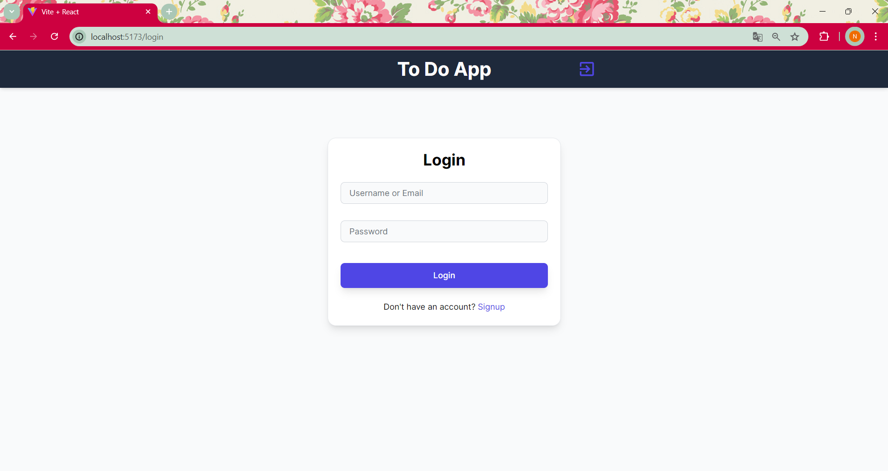

# Todo App

A Todo application with user authentication and CRUD operations for managing tasks.

## Features

- User authentication (Login, Signup, Logout)
- Add, edit, delete, and view todos
- Responsive design

## Tech Stack

- Frontend: React.js, Tailwind CSS
- Backend: PHP
- Database: MySQL

## Screenshots

